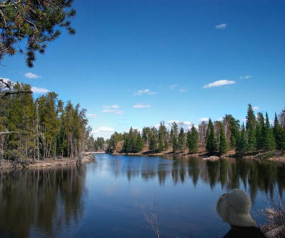

# ImageSmash (Context Aware Image Resizing)

This is a Java implementation of image seam carving. Energy values are
calculated at each pixel and the path of least energy-connected pixel is
removed. The output is a resized image that has lost minimal to no content.
Located below are some images that have been resized using this method. Due to
the nature of this algorithm, resizing too much in any direction will result in image distortion.

## Original

## Resized

